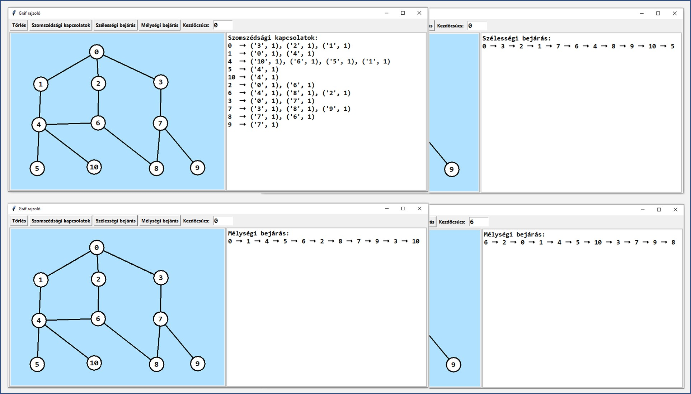

# Gráf megjelenítését és elemzését lehetővé tevő, továbbfejlesztésre szánt alkalmazás
### Gráfok rajzolására szolgáló és az alapvető gráfalgoritmusok megismerését segítő alkalmazás, amely csak egy kiindulópont. Igény szerint bővíthető mind az algoritmusok, mind a funkcionalitást tekintve, és célja is, hogy ezen egyéni továbbfejlesztéseken keresztül nem csak a gráfok használatára, hanem a grafikus felhasználói felület készítésének gyakorlására késztessen.
# Használat
Csúcsok felvétele: Ctrl + bal egérgomb

A csúcsok címkéi automatikusan képződnek nemnegatív egész számok sorozatának formájában.

Csúcsok összekötése:
- Nem irányított él: az összekötendő csúcsokra jobb egérgomb kattintással
- Irányított él: az összekötendő csúcsokra Ctrl + jobb egérgomb kattintással

Él törlése:
- Bal egérgombbal dupla kattintással ki kell jelölni a törlendő élt, amit a vonal színének megváltozása mutat.
- A kijelölés után jobb egérgomb kattintás hatására törlődik az él.
Az ablak felső részén látható Törlés nyomógombbal lehet törölni az eddig rajzolt gráfot és egy újat kezdeni.
A további gombokkal az ablak jobb oldali részében meg lehet jeleníteni a szomszédsági kapcsolatokat, valamint a csúcsok sorrendjét szélességi vagy mélységi bejárás esetén.

### Továbbfejlesztési lehetőségek
Az alkalmazás GUI része számtalan módon továbbfejleszthető. Például lehessen a csúcsoknak tetszőleges címkét adni, vagy az élekhez súlyt rendelni. Továbbá a gráfmodellben látható, hogy az képes legrövidebb utat számolni, vagy akár csúcsot törölni. Ezeket a GUI szándékosan nem kínálja azért, hogy a meglévő kódok kiegészítésével vagy módosításával gyakorolni lehessen a grafikus interfész fejlesztését úgy, hogy van már egy megjelenítésre képes alap. Természetesen a modell is bővíthető úgy, hogy további algoritmusok kezelésére vagy műveletek végzésére legyen képes. Nyilván ilyekor a grafikus interfészt is bővíteni kell.

### Minta képernyőképek
A képen látható gráfot hoztuk létre és kiírattuk a szomszédsági viszonyokat, valamint a szélességi és mélységi bejárást a 0 csúcstól. A mélységi bejárást egy másik csúcstól kezdve is lekértük.

